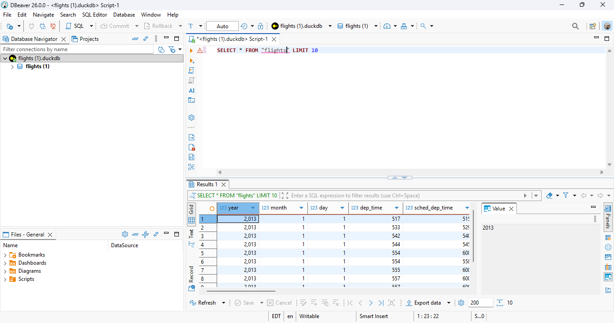

```{r setup, include=FALSE}
knitr::opts_chunk$set(echo = TRUE)
```

```{r}
library(DBI)
library(duckdb)
library(nycflights13)
library(dplyr)

conn <- dbConnect(duckdb::duckdb(), dbdir = ":memory:")
dbWriteTable(conn, "flights", nycflights13::flights)

dbListTables(conn)
```

```{r a}
dbGetQuery(conn, "
  SELECT *
  FROM flights
  LIMIT 10
")
```

```{r}
list.files()
```

```{r b}
dbGetQuery(conn, "
  SELECT carrier, COUNT(*) AS num_flights
  FROM flights
  GROUP BY carrier
  ORDER BY num_flights DESC
")
```

```{r c}
dbGetQuery(conn, "
  SELECT AVG(dep_delay) AS avg_dep_delay
  FROM flights
  WHERE dep_delay IS NOT NULL
")
```

```{r d}
dbGetQuery(conn, "
  SELECT dest AS destination, COUNT(*) AS num_flights
  FROM flights
  GROUP BY dest
  ORDER BY num_flights DESC
  LIMIT 5
")
```

```{r e}
dbGetQuery(conn, "
  SELECT carrier, AVG(arr_delay) AS avg_arr_delay
  FROM flights
  WHERE arr_delay IS NOT NULL
  GROUP BY carrier
  ORDER BY avg_arr_delay DESC
")
```

```{r}
dbDisconnect(conn, shutdown = TRUE)
```

## Part 2:


